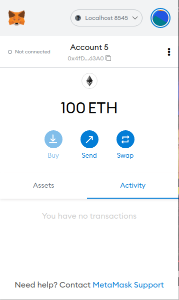
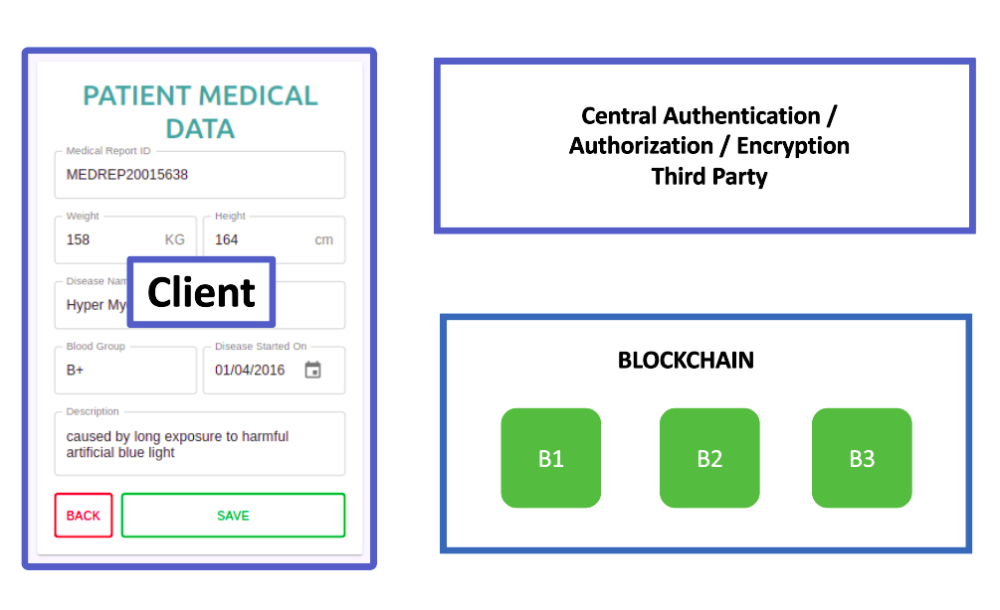
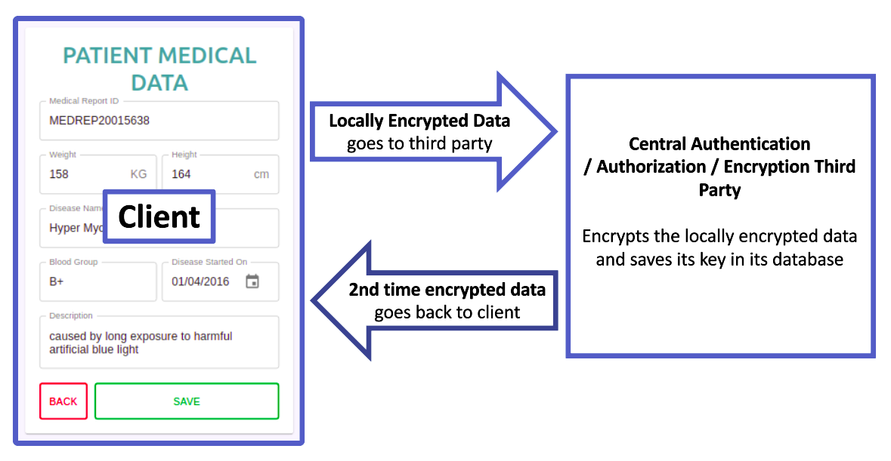
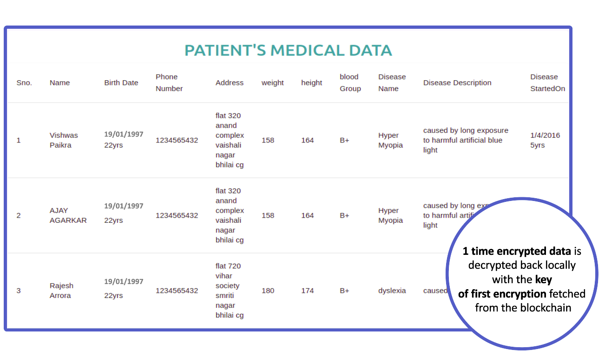

### watch the Project Demo by clicking on the below video

### Install the  following applications in your system
 1. Ganache
 2. Metamak (chrome extension)
### Deploy the contracts in the blockchain network
1. Open Ganache and select quick start
1. Make sure you have truffle installed
2. Use the link to install truffle https://www.npmjs.com/package/truffle
3. Once installed use code > [truffle deploy] .. in the terminal.
4. The address in the contract present in `build/contracts/_.js` will change
5. Copy the address of each contracts and paste it in the `src/contracts/_.js  PATIENT_DATA_LIST_ADDRESS`
### create account in metamask
1. copy one of the private key present in Ganache app
2. Import the private key in the metamask to create account
3. change `not connected` to `connected` 

### To run the project
`npm update` then `npm start` And now you can start saving the patient data.
### Idea behind this project

Blockchain based Database to secure patient data and ensure privacy

# INTRODUCTION

A blockchain is a publicly-managed and verified record of transactional data. All of the data blocks are ordered chronologically and are connected to form a “chain” — hence, the term “blockchain.” All of the chain’s old blocks of data are permanent; they can’t be modified or altered retroactively.
​ Blockchain networks depend on a healthy population of full nodes, i. e. individual peers that store, verify and distribute the full set of data comprising the blockchain—the history of all past transactions. And blockchains are commonly advertised as being immutable, making it impossible to change or erase already posted data. The idea we are submitting uses the method called encryption and hashing to store the data in blockchain in an encrypted form so that no one without the key should be able to see the content of blockchain unless the permission is granted to the user. This can be achieved if we effectively store the key in such a way that nobody can access it and when required it will be readily available. To achieve such a system we had to do some of the work off-chain i.e outside the blockchain. We created a third party system, this system is centralised system making it a perfect candidate to ensure privacy. The main objective of the third party system is to store a unique key of the data (patient data) in such a way that even this third party system will not be able to access the data even with the key stored in it.

# COMPONENTS

`2.1 Blockchain`

A blockchain is a growing list of records, called blocks, that are linked together using cryptography. Each block contains a cryptographic hash of the previous block, a timestamp, and transaction data (generally represented as a Merkle tree). The timestamp proves that the transaction data existed when the block was published in order to get into its hash. As blocks each contain information about the block previous to it, they form a chain, with each additional block reinforcing the ones before it. Therefore, blockchains are resistant to modification of their data because once recorded, the data in any given block cannot be altered retroactively without altering all subsequent blocks.

`2.1.1 Smart Contracts` 

A smart contract is a computer program or a transactional Protocol which is intended to automatically execute, control or document legally relevant events and actions according to the terms of a contract or an agreement.​ The objectives of smart contracts are the reduction of need in trusted intermediators, arbitrations and enforcement costs, fraud losses, as well as the reduction of malicious and accidental exceptions.​ 

`2.1.2 Ethereum`

Ethereum is a decentralized, open-source blockchain with smart-contract functionality. Ether. (ETH) is the native cryptocurrency of the platform. After Bitcoin, it is the second-largest cryptocurrency. 

`2.2 Third Party System`

This is an off-chain centralised system or server where all the keys can be stored. The Data is encrypted with the help of an encryption algorithm called AES (Advanced Encryption Standard) and the key is generated using an cryptographic hash function called SHA-256 (Secure Hash Algorithm 2). 

`2.2.1 Advanced Encryption Standard`

The AES algorithm (also known as the Rijndael algorithm) is a symmetrical block cipher algorithm that takes plain text in blocks of 128 bits and converts them to ciphertext using keys of 128, 192, and 256 bits. Since the AES algorithm is considered secure, it is in the worldwide standard. 

`2.2.2 SHA-256`

A cryptographic hash (sometimes called ‘digest’) is a kind of ‘signature’ for a text or a data file. SHA-256 generates an almost-unique 256-bit (32-byte) signature for a text. 

`2.3 Client`

The client can store the data (patient data) using front end technology (ex web app). Before sending the data to either the blockchain or third party system the data is encrypted locally using AES and SHA-256 is used to generate a key.

Figure 1: Three major components of our application’s architecture to ensure privacy in blockchain

# Working

Three components take part in the encryption, hashing and storage process and they are  Client, Blockchain and the Third party system. 

`3.1 To store the encrypted data in the blockchain we follow the steps given below`

- The client first creates a key using the data as key-text for the SHA-256 cryptographic hashing function. Now the generated key is used to encrypt the data locally using the AES encryption algorithm. 

- Now the encrypted data is sent to the Third Party System where the encrypted data is again encrypted using the steps followed in step-1 i.e the encrypted data is used as key-text for SHA-256 which generates a key and this generated key is used to encrypt the locally encrypted data. The key generated is stored in the database of the server with the id of the owner of the data. 

- Now the encrypted data from the Third Party System is sent back to Client which sends this encrypted data from the Third Party System along with the locally generated key to the blockchain. The blockchain then writes this transaction in the block and stores the data in its database. Which means that every node connected to this blockchain network has this new encrypted data which is immutable. 

`3.2 To fetch encrypted data from the blockchain  we follow the steps given below`

- The encrypted data and the locally generated key stored in blockchain is fetched 

- The encrypted data is then sent to Third Party System where it decrypts the data using the key stored in it’s database with user ID and we get the locally encrypted data but only if there is a permission by the owner of the data to share it with the owner of the request sent from the client. This decrypted data is then sent to the client. 

- The decrypted data from the Third Party System is then decrypted to original data using the key fetched from the blockchain. And we get the original data to show it to the world.

Figure 2: Figure showing transmission of data between the Client and the Third Party System

# CONCLUSIONS

We know that the data in blockchain is immutable i.e once the data is written in the blockchain it cannot be deleted and any body have access to the blockchain network can access the any data  present inside the blockchain which is a major issue with blockchain especially if we want to create a database in the blockchain which needs to be deleted once its work is over or if any user wants its data to be removed from the database or if you don't want to share your data with everyone or you want to share your data with the selected few. So in order to achieve a little privacy inside the blockchain we created this method where the original data is encrypted twice first locally and then in the Third party system. And when we send the data to the  blockchain the data is in encrypted form so it means that  if somebody tries to look inside the blockchain to steal the data for fault reasons it will be useless as the person will not be able to understand this data. In case if a user would one day wish its data to be deleted from the blockchain it can be apparently done by deleting all the keys associated with the data in order to decrypt the data. It means that the key of the encrypted data present in the Third Party System’s database associated with its respective owner will simply be deleted. Once the key is deleted the encrypted data is nothing more than random bits which are totally useless and cannot be utilized in any shape or form. This is how our method works to achieve privacy within blockchain.

Figure 3: An image showing locally decrypted data retrieved from the blockchain in encrypted form.

# ACKNOWLEDGEMENT

This research was supported by Government Engineering College, Raipur and We are thankful to our guide Asst. Prof. Priyanka Sahu who provided expertise that greatly assisted the research.

# REFERENCES

- “Blockchain”  https://en.wikipedia.org/wiki/Blockchain
- “Ethereum” https://ethereum.org/en/
- “Smart Contracts”  https://ethereum.org/en/developers/docs/smart-contracts/
- “SHA-256” https://en.wikipedia.org/wiki/SHA-2
- “AES”  https://www.educative.io/edpresso/what-is-the-aes-algorithm
- "How to Build Ethereum Dapp with React.js · Complete Step-By-Step Guide" https://www.dappuniversity.com/articles/ethereum-dapp-react-tutorial

# Developer's details

1. Vishwas Paikra https://github.com/vishwaspaikra007
2. Satyam Lachhwani https://github.com/Satyam1203
3. Diksha Verma https://github.com/dikshaverma011

